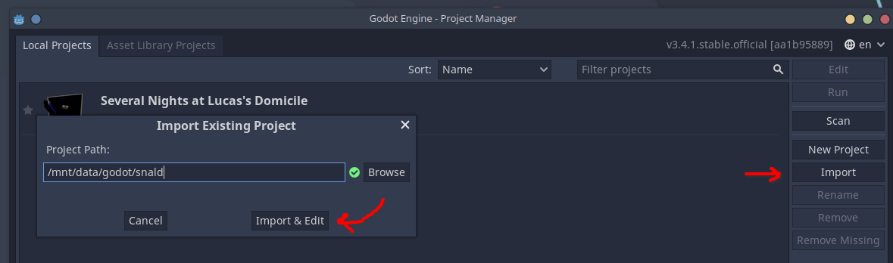
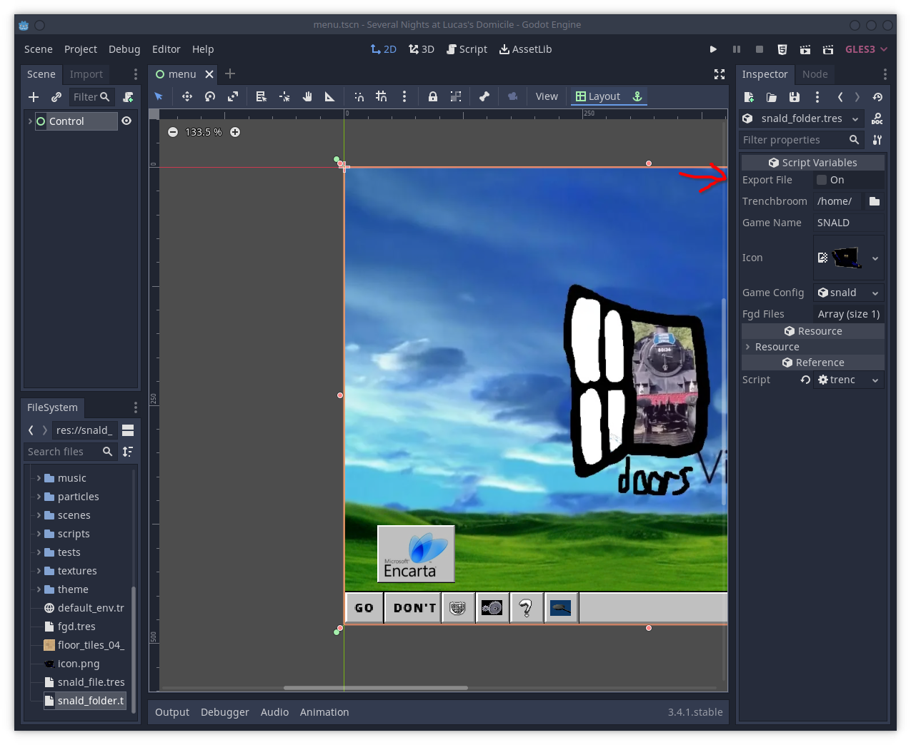

# Preparing your Environment
## Dependencies
To start, you'll need to have these programs installed:
* Git
* Godot 3.5.1
* TrenchBroom
* Blender

> *On Linux,* you can skip installing Godot manually. We use a shell script to automatically manage Godot installation.

## Getting SNALD's source code
SNALD is an open-source game, which means you have complete access to its source code, and can modify it easily. However, SNALD's source code is not completely yours to use; you have to comply with the terms of our license. We use the [MPLv2.0](https://github.com/hwcgames/snald/blob/main/LICENSE), which we thought was a good compromise. You can read more about your obligations under this license on [TLDRLegal](https://www.tldrlegal.com/license/mozilla-public-license-2-0-mpl-2). Essentially, you must release the source code of your project to everyone who has access to it, but you can still maintain some control over your project's distribution. For example, SNALD's art assets are not covered by this license and you should avoid redistributing them.

Once the legal restrictions are out of the way, the technical process of obtaining SNALD's source code is trivial. Open your terminal, move into your projects directory, and use your git client to clone the repository at [https://github.com/hwcgames/snald](https://github.com/hwcgames/snald), like `git clone https://github.com/hwcgames/snald.git`. If you've made a fork on GitHub, you should clone that instead.

## Setting up Godot

Once you've downloaded Godot 3.5.1, you can import the repository that you cloned as shown in this screenshot.



> *On Linux,* you can just run `./godot . --editor` to open the editor. This will install and manage Godot automatically.

## Setting up TrenchBroom for SNALD
The plugin we use to load Quake-style maps in SNALD can generate an FGD file, but you have to tell it where it should go. Create a file called `snald_folder.tres` in the root of the project, and fill it with something like this:

```toml
[gd_resource type="Resource" load_steps=5 format=2]

[ext_resource path="res://icon.png" type="Texture" id=2]
[ext_resource path="res://addons/qodot/src/resources/game-definitions/trenchbroom/trenchbroom_game_config_folder.gd" type="Script" id=3]
[ext_resource path="res://fgd.tres" type="Resource" id=4]
[ext_resource path="res://snald_file.tres" type="Resource" id=5]

[resource]
script = ExtResource( 3 )
export_file = false
trenchbroom_games_folder = "/path/to/your/.TrenchBroom/games"
game_name = "YOUR_GAME_NAME"
icon = ExtResource( 2 )
game_config_file = ExtResource( 5 )
fgd_files = [ ExtResource( 4 ) ]
```

> *On Linux,* you can run `snald_folder.sh` and paste in the path to your TrenchBroom games folder to generate this file. It uses the name of the source code directory in all caps as the game's name.

Next, open the project in Godot and open the `snald_folder.tres` file there. Check the box in the inspector that says 'Export File'. It will immediately uncheck itself, and the FGD file will have been generated.



Also, to enable developer features in your save file, type `shibboleet` into the text field in settings. You can also do this in production builds if you want to play around with developer features a little. Using cheats or developer features will mark your title screen to prevent casual cheating, so be aware of that.